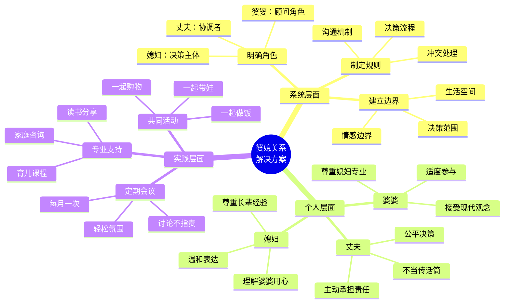

# 婆媳关系可视化 - Mermaid 图表集

## 图1：婆媳关系系统图（丰富版）

```mermaid
graph TB
    subgraph 家庭系统 🏠
        MIL[婆婆 👵]
        DIL[媳妇 👩]
        H[丈夫 👨]
        C[孩子 👶]

        subgraph 核心矛盾 ⚡
            UC1[照顾孩子 🍼]
            UC2[家务分工 🧹]
            UC3[经济管理 💰]
            UC4[家庭决策 🤔]
            UC5[情感支持 ❤️]
        end

        subgraph 期待差异 💭
            T1[传统 vs 现代]
            T2[经验 vs 科学]
            T3[主导 vs 平等]
        end
    end

    MIL -->|想帮忙| UC1
    MIL -->|习惯主导| UC2
    MIL -->|期待参与| UC4
    MIL -.->|传统期待| T1

    DIL -->|科学育儿| UC1
    DIL -->|平等分工| UC2
    DIL -->|独立管理| UC3
    DIL -->|平等决策| UC4
    DIL -->|需要支持| UC5
    DIL -.->|现代期待| T1

    H -->|主要责任| UC3
    H -->|最终决策者| UC4
    H -->|支持双方| UC5
    H -.->|左右为难| T3

    C -->|被照顾| UC1

    style MIL fill:#ffcccc,stroke:#ff6666,stroke-width:3px
    style DIL fill:#cce5ff,stroke:#3399ff,stroke-width:3px
    style H fill:#fff5cc,stroke:#ffcc00,stroke-width:3px
    style C fill:#ccffcc,stroke:#66cc66,stroke-width:3px

    style T1 fill:#ffe6e6,stroke:#ff9999
    style T2 fill:#e6f3ff,stroke:#99ccff
    style T3 fill:#fff9e6,stroke:#ffdd99
```

---

## 图2：冲突升级时序图（丰富版）

```mermaid
sequenceDiagram
    autonumber
    participant 婆婆 👵
    participant 丈夫 👨
    participant 媳妇 👩

    Note over 婆婆,媳妇: 场景：孩子吃什么？

    婆婆->>丈夫: 孩子该吃米糊了<br/>(经验判断)
    activate 丈夫
    Note right of 婆婆: 婆婆的出发点<br/>✓ 我养大3个孩子<br/>✓ 有经验<br/>✓ 想帮忙

    丈夫->>媳妇: 妈说给孩子吃米糊<br/>(简单传话)
    activate 媳妇
    Note left of 丈夫: ❌ 只当传话筒<br/>❌ 不加思考<br/>❌ 不提供信息

    媳妇->>丈夫: 医生建议6个月后<br/>(科学依据)
    deactivate 媳妇
    Note right of 媳妇: 媳妇的依据<br/>✓ 医生建议<br/>✓ 科学育儿<br/>✓ 专业权威

    丈夫->>婆婆: 媳妇说要听医生的<br/>(再次传话)
    deactivate 丈夫

    Note over 婆婆: 😢 我不被信任<br/>😤 经验被否定<br/>💔 儿子不站我这边

    婆婆-->>媳妇: 我养大3个孩子，<br/>还不知道？<br/>(情绪化回应)

    Note over 媳妇: 😤 专业被质疑<br/>😡 婆婆不讲理<br/>💔 丈夫不帮我

    媳妇-->>婆婆: 现在的科学和<br/>以前不一样！<br/>(反击)

    Note over 婆婆,媳妇: 💥 冲突爆发！

    婆婆->>丈夫: 你媳妇不尊重我
    媳妇->>丈夫: 你妈太固执了
    丈夫->>丈夫: 我太难了... 😫

    Note over 婆婆,媳妇,丈夫: 根本原因：<br/>1. 沟通路径错误（丈夫中转）<br/>2. 缺乏共同决策机制<br/>3. 期待不同（经验 vs 科学）<br/>4. 情绪化表达代替理性讨论
```

---

## 图3：理想决策流程（丰富版）

```mermaid
flowchart TD
    Start([家庭问题出现]) --> Step1

    subgraph 媳妇流程 👩
        Step1[提出需求或问题]
        Step1_Note[例如：孩子辅食问题]
    end

    Step1 --> Step2

    subgraph 婆婆流程 👵
        Step2[表达意见和经验]
        Step2_Note[婆婆的优势：<br/>✓ 生活经验<br/>✓ 实用技巧<br/>✓ 关心家庭]
    end

    Step2 --> Step3

    subgraph 丈夫流程 👨
        Step3[收集双方观点]
        Step4[查找权威信息]
        Step3_Note[丈夫的职责：<br/>✓ 听取双方意见<br/>✓ 查证专业信息<br/>✓ 不偏不倚]
    end

    Step3 --> Step4
    Step4 --> Step5

    subgraph 家庭会议 🏠
        Step5[共同讨论]
        Step5_Note[讨论原则：<br/>✓ 所有人发言<br/>✓ 不打断<br/>✓ 不批评<br/>✓ 记录要点]

        Decision{达成一致？}
    end

    Step5 --> Decision

    Decision -->|是 ✅| Step6
    Decision -->|否 ❌| Step7

    subgraph 执行阶段
        Step6[全员执行决策]
        Step6_2[定期复盘]

        Step7[丈夫作为最终决策者]
        Step7_2[说明决策理由]
        Step8[全员尊重决策]
        Step8_2[全力执行]
    end

    Step6 --> Step6_2
    Step7 --> Step7_2
    Step7_2 --> Step8
    Step8 --> Step8_2

    Step6_2 --> End([问题解决])
    Step8_2 --> End

    End --> Review[记录到家庭档案]
    Review --> NextTime[下次会议回顾]

    style Start fill:#e1f5e1,stroke:#66cc66,stroke-width:3px
    style End fill:#e1f5e1,stroke:#66cc66,stroke-width:3px
    style Decision fill:#fff5cc,stroke:#ffcc00,stroke-width:3px

    style Step1 fill:#cce5ff,stroke:#3399ff
    style Step2 fill:#ffcccc,stroke:#ff6666
    style Step3 fill:#fff5cc,stroke:#ffcc00
    style Step4 fill:#fff5cc,stroke:#ffcc00
    style Step5 fill:#e6ffe6,stroke:#66cc66
```

---

## 图4：角色期待对比（新增）

```mermaid
graph LR
    subgraph 婆婆的期待 🎯
        P1[传统角色]
        P2[主导家务]
        P3[参与育儿]
        P4[被尊重]
        P5[传承经验]
    end

    subgraph 媳妇的期待 🎯
        D1[现代角色]
        D2[平等分工]
        D3[科学育儿]
        D4[独立空间]
        D5[专业权威]
    end

    subgraph 冲突点 ⚡
        C1[角色定位冲突]
        C2[主导权冲突]
        C3[育儿方式冲突]
        C4[边界感冲突]
        C5[决策权冲突]
    end

    P1 -.->|冲突| C1
    D1 -.->|冲突| C1

    P2 -.->|冲突| C2
    D2 -.->|冲突| C2

    P3 -.->|冲突| C3
    D3 -.->|冲突| C3

    P4 -.->|冲突| C4
    D4 -.->|冲突| C4

    P5 -.->|冲突| C5
    D5 -.->|冲突| C5

    style P1 fill:#ffcccc
    style P2 fill:#ffcccc
    style P3 fill:#ffcccc
    style P4 fill:#ffcccc
    style P5 fill:#ffcccc

    style D1 fill:#cce5ff
    style D2 fill:#cce5ff
    style D3 fill:#cce5ff
    style D4 fill:#cce5ff
    style D5 fill:#cce5ff

    style C1 fill:#ffe6e6,stroke:#ff6666,stroke-width:2px
    style C2 fill:#ffe6e6,stroke:#ff6666,stroke-width:2px
    style C3 fill:#ffe6e6,stroke:#ff6666,stroke-width:2px
    style C4 fill:#ffe6e6,stroke:#ff6666,stroke-width:2px
    style C5 fill:#ffe6e6,stroke:#ff6666,stroke-width:2px
```

---

## 图5：解决方案框架（新增）



---

## 图6：情感账户模型（新增）

```mermaid
graph TB
    subgraph 婆婆情感账户 💰
        P_Pos[正面存款]
        P_Neg[负面取款]

        P1[帮忙带娃 +100]
        P2[关心问候 +50]
        P3[分享经验 +30]

        P4[干涉决策 -100]
        P5[批评指责 -150]
        P6[翻旧账 -200]
    end

    subgraph 媳妇情感账户 💰
        D_Pos[正面存款]
        D_Neg[负面取款]

        D1[尊重长辈 +100]
        D2[感恩表达 +50]
        D3[请教经验 +30]

        D4[忽视建议 -100]
        D5[冷漠相对 -150]
        D6[背后抱怨 -200]
    end

    subgraph 丈夫情感账户 💰
        H_Pos[正面存款]
        H_Neg[负面取款]

        H1[公平协调 +100]
        H2[及时肯定 +50]
        H3[解决问题 +30]

        H4[偏袒一方 -100]
        H5[逃避责任 -150]
        H6[传话升级 -200]
    end

    P_Pos --> P1
    P_Pos --> P2
    P_Pos --> P3

    P_Neg --> P4
    P_Neg --> P5
    P_Neg --> P6

    D_Pos --> D1
    D_Pos --> D2
    D_Pos --> D3

    D_Neg --> D4
    D_Neg --> D5
    D_Neg --> D6

    H_Pos --> H1
    H_Pos --> H2
    H_Pos --> H3

    H_Neg --> H4
    H_Neg --> H5
    H_Neg --> H6

    style P_Pos fill:#e1f5e1,stroke:#66cc66
    style P_Neg fill:#ffe6e6,stroke:#ff6666
    style D_Pos fill:#e1f5e1,stroke:#66cc66
    style D_Neg fill:#ffe6e6,stroke:#ff6666
    style H_Pos fill:#e1f5e1,stroke:#66cc66
    style H_Neg fill:#ffe6e6,stroke:#ff6666
```

---

## 手绘风格说明

**Mermaid 本身不支持手绘风格，但有几种方式实现：**

### 方法1：使用 CSS 样式（推荐）

在 Mermaid 渲染后添加自定义 CSS：

```css
/* 手绘风格 CSS */
.mermaid {
  font-family: 'Comic Sans MS', cursive, sans-serif;
}

.node rect, .node circle, .node ellipse, .node polygon, .node path {
  stroke-width: 2;
  stroke-dasharray: 5,5;
  filter: url(#sketchy);
}

.edgePath .path {
  stroke-width: 2;
  stroke-dasharray: 5,5;
}

/* 添加手绘滤镜 */
@filter url(#sketchy) {
  <filter id="sketchy">
    <feTurbulence type="turbulence" baseFrequency="0.05" numOctaves="2" result="noise"/>
    <feDisplacementMap in="SourceGraphic" in2="noise" scale="3" />
  </filter>
}
```

### 方法2：使用在线工具

**推荐工具**：
1. **Mermaid Live Editor**：https://mermaid.live/
   - 支持实时预览
   - 可以导出 SVG/PNG
   - 可以添加自定义主题

2. **Draw.io**：https://app.diagrams.net/
   - 导入 Mermaid 代码
   - 应用手绘风格主题
   - 导出高质量图片

3. **Excalidraw**：https://excalidraw.com/
   - 原生手绘风格
   - 可以手动重绘
   - 审美在线

### 方法3：后期处理

1. 用 Mermaid 生成基础图
2. 导出为 SVG
3. 用 Figma/Sketch 添加手绘效果
4. 应用不规则线条、手写字体

---

## 🎨 推荐配色方案

### 暖色系（推荐）
```css
/* 婆婆 */
--color-mil: #FFB6C1; /* 浅粉 */
--color-mil-dark: #FF69B4; /* 深粉 */

/* 媳妇 */
--color-dil: #87CEEB; /* 天蓝 */
--color-dil-dark: #4169E1; /* 皇家蓝 */

/* 丈夫 */
--color-h: #F0E68C; /* 卡其 */
--color-h-dark: #DAA520; /* 金麒麟 */

/* 孩子 */
--color-child: #98FB98; /* 浅绿 */
--color-child-dark: #32CD32; /* 酸橙绿 */
```

### 手绘字体推荐
1. **中文**：方正手迹、汉仪小麦、造字工房童心
2. **英文**：Comic Sans MS、KG Primary Penmanship、Architects Daughter

---

## 📊 使用建议

### 生成流程
```
1. 用 Mermaid Live Editor 渲染图表
   ↓
2. 导出为 SVG（矢量图，可编辑）
   ↓
3. 用 Figma/Canva 添加手绘效果
   ↓
4. 导出为 PNG（适合小红书）
```

### 批量生成
```bash
# 使用 mermaid-cli 批量导出
npm install -g @mermaid-js/mermaid-cli

# 批量转换
mmdc -i diagram1.md -o diagram1.png
mmdc -i diagram2.md -o diagram2.png
mmdc -i diagram3.md -o diagram3.png
```

---

**创建时间**：2026-03-26 20:14
**图表数量**：6个（系统图、时序图、流程图、对比图、思维导图、情感账户）
**格式**：Mermaid（可渲染为 SVG/PNG）
