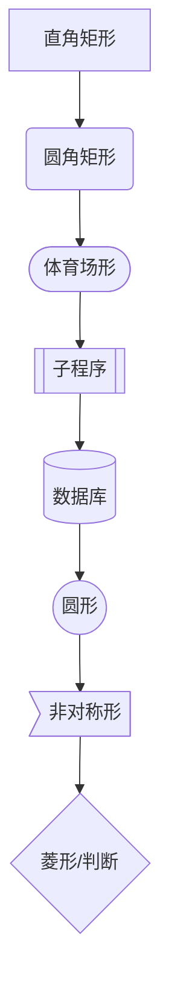
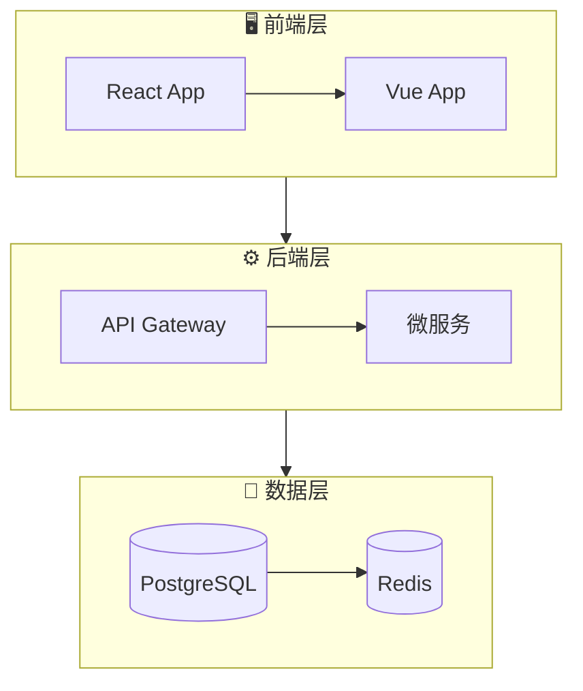
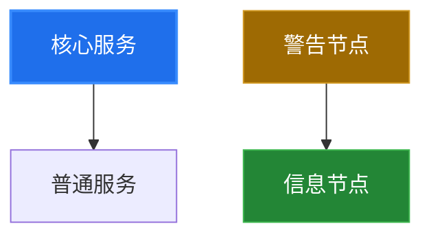
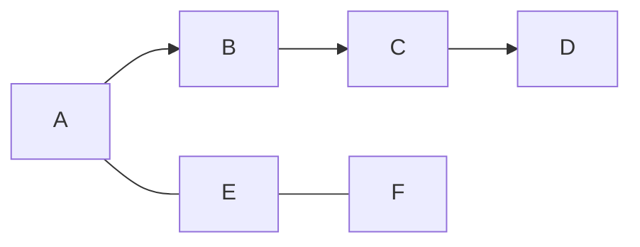

# kais-draw

智能架构图绘制引擎。根据画图目标自动选择 Mermaid 或 PlantUML，应用美化技巧，输出适配 Notion 深色主题的代码。

## 核心原则

1. **Notion 深色主题优先** — 所有输出默认适配 Notion 暗色背景，箭头/线条/文字在深色背景上清晰可见
2. **美观优先** — 应用 Beautiful Mermaid 等美化技巧，图表要有设计感
3. **格式自选** — 根据需求自动选择最佳格式（见下方决策矩阵）
4. **可直接粘贴到 Notion** — 输出即用，用户复制代码块到 Notion 即可渲染

## 格式选择决策矩阵

| 图表类型 | 推荐格式 | 原因 |
|---------|---------|------|
| 流程图 Flowchart | Mermaid ✅ | Notion 原生支持，语法简洁 |
| 时序图 Sequence | Mermaid ✅ | Notion 原生支持，暗色主题友好 |
| 类图 Class | PlantUML ✅ | 语法更强大，关系表达更丰富 |
| 状态图 State | Mermaid ✅ | Notion 原生支持 |
| ER 图 | Mermaid ✅ | Notion 原生支持 |
| 甘特图 | Mermaid ✅ | Notion 原生支持 |
| 思维导图 Mindmap | Mermaid ✅ | Notion 原生支持 |
| 用例图 Use Case | PlantUML ✅ | Mermaid 不支持 |
| 组件图/部署图 | PlantUML ✅ | Mermaid 不支持 |
| 复杂架构图（多层级） | PlantUML ✅ | 支持嵌套、样式更灵活 |
| C4 架构图 | PlantUML ✅ | C4-PlantUML 库成熟 |

**默认选择 Mermaid**（Notion 原生渲染），仅在 Mermaid 不支持或语法限制时使用 PlantUML。

## Notion 深色主题适配方案

### Mermaid：使用 `dark` 主题 + 自定义变量

所有 Mermaid 代码块**必须**包含以下 frontmatter 配置：

```mermaid
%%{init: {'theme': 'base', 'themeVariables': { 'darkMode': true, 'background': '#191919', 'primaryColor': '#1f6feb', 'primaryTextColor': '#e6edf3', 'primaryBorderColor': '#388bfd', 'lineColor': '#8b949e', 'secondaryColor': '#161b22', 'tertiaryColor': '#21262d', 'noteBkgColor': '#1c2128', 'noteTextColor': '#e6edf3', 'noteBorderColor': '#388bfd', 'fontFamily': 'Segoe UI, sans-serif', 'fontSize': '14px' }} }%%
```

**关键要点：**
- 必须用 `base` 主题（唯一可自定义的主题），`darkMode: true`
- `background` 设为 `#191919`（Notion 暗色背景色）
- `lineColor` 必须用浅灰色（`#8b949e`），**绝不能用黑色或深色**（暗色模式下会消失）
- `primaryColor` 用蓝色系（`#1f6feb`），节点背景深蓝色，文字白色
- `primaryBorderColor` 用亮蓝色（`#388bfd`），边框在暗色背景上清晰可见

### PlantUML：使用 skinparam 暗色配置

所有 PlantUML 代码块**必须**包含以下暗色主题设置：

```plantuml
@startuml
!theme vibrant
skinparam backgroundColor #191919
skinparam defaultFontColor #e6edf3
skinparam arrowColor #8b949e
skinparam actorBorderColor #388bfd
skinparam participantBorderColor #388bfd
skinparam participantBackgroundColor #1c2128
skinparam actorBackgroundColor #1c2128
skinparam classBorderColor #388bfd
skinparam classBackgroundColor #1c2128
skinparam noteBorderColor #388bfd
skinparam noteBackgroundColor #1c2128
skinparam cloudBorderColor #388bfd
skinparam cloudBackgroundColor #1c2128
skinparam componentBorderColor #388bfd
skinparam componentBackgroundColor #1c2128
skinparam sequenceLifeLineBorderColor #30363d
skinparam sequenceParticipantBorderColor #388bfd
skinparam sequenceParticipantBackgroundColor #1c2128
```

**关键要点：**
- `backgroundColor #191919` 匹配 Notion 暗色背景
- 所有边框用亮蓝色 `#388bfd`，确保暗色背景可见
- 箭头用浅灰 `#8b949e`，**绝不用黑色**
- 文字用浅色 `#e6edf3`
- 节点背景用深色 `#1c2128`

## Beautiful Mermaid 美化技巧

### 1. 节点形状多样化



### 2. 子图分组



### 3. 连线样式

```mermaid
graph LR
    A -->|实线箭头| B
    B ---|实线无箭头| C
    C -.-|虚线无箭头| D
    D ==>|粗箭头| E
    E --text-->|带文字| F
```

### 4. 样式类（给节点自定义颜色）



### 5. 图表方向选择

| 方向 | 代码 | 适用场景 |
|------|------|---------|
| 从上到下 | `graph TD` | 层级架构、组织结构 |
| 从左到右 | `graph LR` | 流程、管道、时间线 |
| 从下到上 | `graph BT` | 根因分析、依赖树 |
| 从右到左 | `graph RL` | 反向流程 |

### 6. 链表写法（简洁表达）



## 执行流程

### Step 1: 需求分析

与用户确认（或从上下文推断）：
1. **图表类型**：架构图/流程图/时序图/类图/其他？
2. **内容要素**：有哪些节点、关系、分组？
3. **复杂度**：简单（<10节点）/ 中等（10-30）/ 复杂（>30）
4. **输出格式**：默认 Mermaid（Notion 原生），特殊需求用 PlantUML

### Step 2: 格式选择

根据决策矩阵选择格式。**默认 Mermaid**。

### Step 3: 代码生成

1. 先生成图表骨架（节点 + 关系）
2. 应用 Notion 深色主题配置
3. 应用美化技巧（子图分组、样式类、形状多样化）
4. 检查暗色适配（箭头可见、文字清晰、边框可见）

### Step 4: 质量检查

**输出前自检清单：**
- [ ] 包含 `%%{init: ...}%%` 深色主题配置（Mermaid）或 `skinparam` 暗色设置（PlantUML）
- [ ] `lineColor` / `arrowColor` 为浅灰色，非黑色
- [ ] 节点文字颜色为浅色（`#e6edf3`）
- [ ] 边框颜色为亮色（`#388bfd`）
- [ ] 使用了子图分组或样式类提升美观度
- [ ] 代码可直接粘贴到 Notion 渲染
- [ ] Audit JSON 已写入 `/shared_memory/projects/{project_name}/audit.log`

### Step 5: 交付

输出格式：
```
### [图表名称]

\`\`\`mermaid
%%{init: {'theme': 'base', 'themeVariables': {...}}}%%
graph TD
    ...
\`\`\`

> 💡 复制以上代码块到 Notion 的 Mermaid 代码块中即可渲染
```

### Step 6: Audit JSON 输出

每次执行完成后，必须输出 audit JSON 记录到项目的 audit.log 文件。

**写入路径**: `/shared_memory/projects/{project_name}/audit.log`（每行一个 JSON，追加写入）

如果没有明确项目名，使用 `default` 作为 project_name。目录不存在时自动创建。

**Audit JSON 格式**：

```json
{
  "expert": "drawer",
  "task_id": "唯一ID（UUID或时间戳+随机数）",
  "timestamp": "ISO-8601格式",
  "project": "项目名",
  "parameters": {
    "diagram_type": "flowchart|sequence|class|er|state|gantt|mindmap|usecase|component|c4",
    "format": "mermaid|plantuml",
    "node_count": 0,
    "edge_count": 0,
    "subgraph_count": 0,
    "complexity": "simple|medium|complex",
    "theme": "dark-notion"
  },
  "metrics": {
    "dark_theme_compliance": 0,
    "visual_clarity": 0,
    "notation_correctness": 0,
    "notion_compatibility": 0
  },
  "output": {
    "code_blocks": ["mermaid或plantuml代码块内容摘要"],
    "count": 1,
    "format": "mermaid|plantuml"
  },
  "duration_ms": 0,
  "status": "success|failure",
  "error": null
}
```

**字段说明**：
- `parameters.diagram_type`: 图表类型（flowchart/sequence/class 等）
- `parameters.format`: 使用的格式（mermaid 或 plantuml）
- `parameters.node_count`: 节点数量
- `parameters.edge_count`: 连线数量
- `parameters.subgraph_count`: 子图数量
- `parameters.complexity`: 复杂度评估（simple <10节点, medium 10-30, complex >30）
- `metrics.*`: 评分 0-100，初始可填占位符 0，后续由 AI 或人工评估填入
  - `dark_theme_compliance`: 暗色主题适配程度
  - `visual_clarity`: 视觉清晰度
  - `notation_correctness`: 语法正确性
  - `notion_compatibility`: Notion 兼容性
- `output.code_blocks`: 输出的代码块摘要（避免存储完整大图代码）
- `duration_ms`: 执行耗时（毫秒）
- `status`: 执行状态
- `error`: 失败时的错误信息

**写入方式**：使用 shell 命令追加写入，确保每行一个完整 JSON：
```bash
mkdir -p /shared_memory/projects/{project_name}
echo '<JSON单行>' >> /shared_memory/projects/{project_name}/audit.log
```

## 常见图表模板

内置 7 种图表模板，详见 `references/templates.md`：
- 系统架构图（Mermaid flowchart + 子图分组 + 样式类）
- 时序图（Mermaid sequence）
- 类图（PlantUML）
- ER 图（Mermaid erDiagram）
- 思维导图（Mermaid mindmap）
- 状态图（Mermaid stateDiagram）
- 甘特图（Mermaid gantt）

所有模板均包含 Notion 深色主题配置，可直接复制使用。

## 自由度声明

<!-- FREEDOM:low -->
- 深色主题配置参数**必须严格遵循**上述方案，不得自行修改颜色值
- 格式选择**必须遵循**决策矩阵，不得随意切换
- 图表类型和语法**必须符合** Mermaid/PlantUML 官方规范
- 节点命名和结构设计可根据需求灵活调整
<!-- /FREEDOM:low -->
