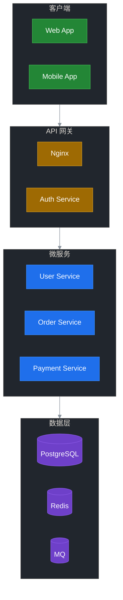
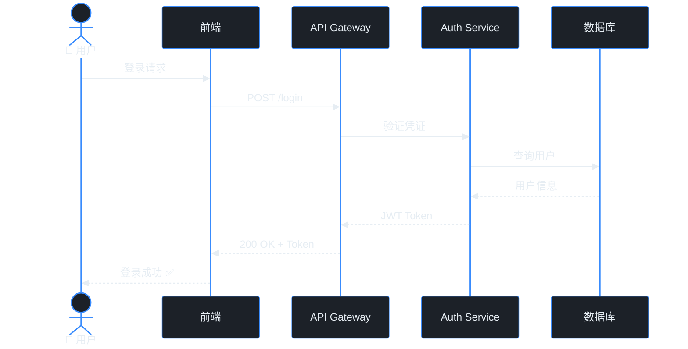
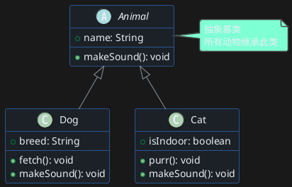
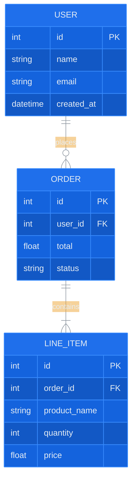
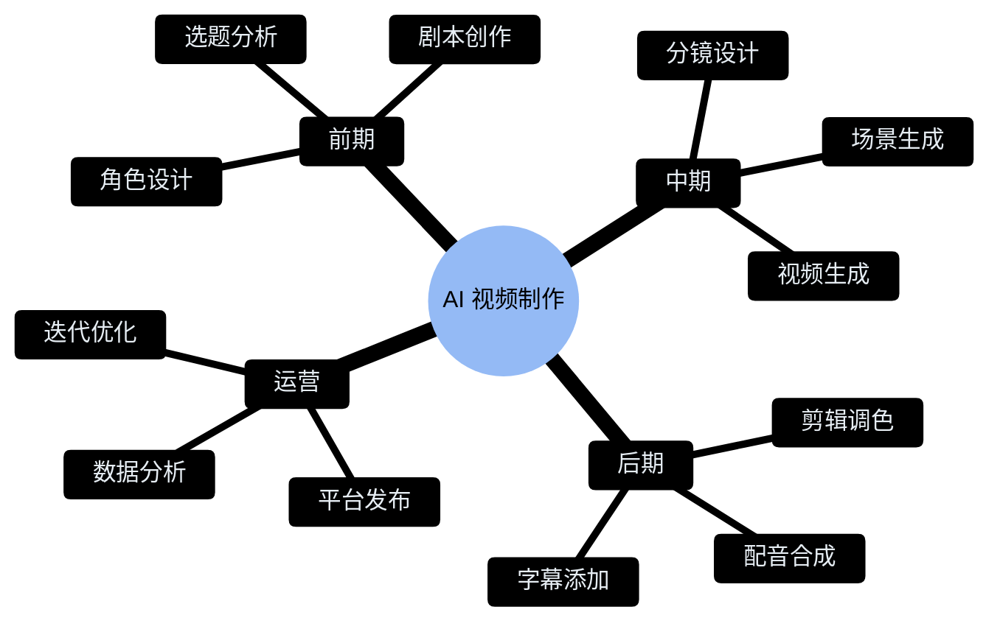
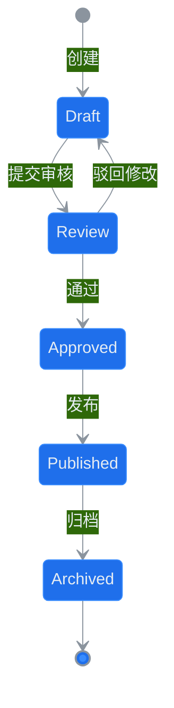
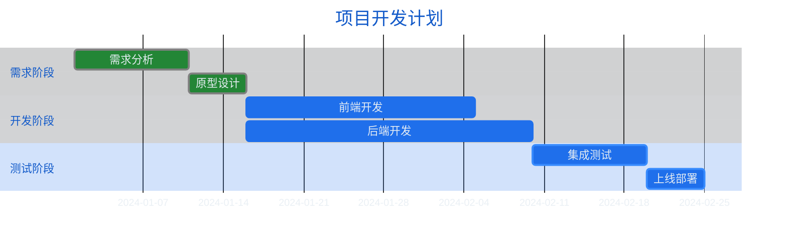

# 常见图表模板（Notion 深色主题）

> 以下模板均适配 Notion 深色背景，可直接复制到 Notion 的代码块中使用。

## 系统架构图

```mermaid
%%{init: {'theme': 'base', 'themeVariables': { 'darkMode': true, 'background': '#191919', 'primaryColor': '#1f6feb', 'primaryTextColor': '#e6edf3', 'primaryBorderColor': '#388bfd', 'lineColor': '#8b949e', 'secondaryColor': '#161b22', 'tertiaryColor': '#21262d', 'noteBkgColor': '#1c2128', 'noteTextColor': '#e6edf3', 'noteBorderColor': '#388bfd' }} }%%
graph TD
    subgraph Client["客户端"]
        A[Web App]:::client
        B[Mobile App]:::client
    end
    subgraph Gateway["API 网关"]
        C[Nginx]:::gateway
        D[Auth Service]:::gateway
    end
    subgraph Services["微服务"]
        E[User Service]:::service
        F[Order Service]:::service
        G[Payment Service]:::service
    end
    subgraph Data["数据层"]
        H[(PostgreSQL)]:::data
        I[(Redis)]:::data
        J[(MQ)]:::data
    end
    Client --> Gateway --> Services --> Data

    classDef client fill:#238636,stroke:#3fb950,color:#fff
    classDef gateway fill:#9e6a03,stroke:#d29922,color:#fff
    classDef service fill:#1f6feb,stroke:#388bfd,color:#fff
    classDef data fill:#6e40c9,stroke:#8957e5,color:#fff
```

## 时序图

```mermaid
%%{init: {'theme': 'base', 'themeVariables': { 'darkMode': true, 'background': '#191919', 'primaryColor': '#1f6feb', 'primaryTextColor': '#e6edf3', 'primaryBorderColor': '#388bfd', 'lineColor': '#8b949e', 'actorBkg': '#1c2128', 'actorBorder': '#388bfd', 'actorTextColor': '#e6edf3', 'signalColor': '#e6edf3', 'signalTextColor': '#e6edf3', 'labelBoxBkgColor': '#1c2128', 'labelBoxBorderColor': '#388bfd', 'labelTextColor': '#e6edf3', 'loopTextColor': '#e6edf3', 'noteBkgColor': '#1c2128', 'noteTextColor': '#e6edf3', 'noteBorderColor': '#388bfd' }} }%%
sequenceDiagram
    actor User as 👤 用户
    participant Front as 前端
    participant API as API Gateway
    participant Auth as Auth Service
    participant DB as 数据库

    User->>Front: 登录请求
    Front->>API: POST /login
    API->>Auth: 验证凭证
    Auth->>DB: 查询用户
    DB-->>Auth: 用户信息
    Auth-->>API: JWT Token
    API-->>Front: 200 OK + Token
    Front-->>User: 登录成功 ✅
```

## 类图（PlantUML）

```plantuml
@startuml
!theme vibrant
skinparam backgroundColor #191919
skinparam defaultFontColor #e6edf3
skinparam classBorderColor #388bfd
skinparam classBackgroundColor #1c2128
skinparam classArrowColor #8b949e
skinparam shadowing false

abstract class Animal {
  + name: String
  + makeSound(): void
}

class Dog {
  + breed: String
  + fetch(): void
  + makeSound(): void
}

class Cat {
  + isIndoor: boolean
  + purr(): void
  + makeSound(): void
}

Animal <|-- Dog
Animal <|-- Cat

note right of Animal
  抽象基类
  所有动物继承此类
end note
@enduml
```

## ER 图

```mermaid
%%{init: {'theme': 'base', 'themeVariables': { 'darkMode': true, 'background': '#191919', 'primaryColor': '#1f6feb', 'primaryTextColor': '#e6edf3', 'primaryBorderColor': '#388bfd', 'lineColor': '#8b949e' }} }%%
erDiagram
    USER ||--o{ ORDER : places
    ORDER ||--|{ LINE_ITEM : contains
    USER {
        int id PK
        string name
        string email
        datetime created_at
    }
    ORDER {
        int id PK
        int user_id FK
        float total
        string status
    }
    LINE_ITEM {
        int id PK
        int order_id FK
        string product_name
        int quantity
        float price
    }
```

## 思维导图

```mermaid
%%{init: {'theme': 'base', 'themeVariables': { 'darkMode': true, 'background': '#191919', 'primaryColor': '#1f6feb', 'primaryTextColor': '#e6edf3', 'primaryBorderColor': '#388bfd', 'lineColor': '#8b949e' }} }%%
mindmap
  root((AI 视频制作))
    前期
      选题分析
      剧本创作
      角色设计
    中期
      分镜设计
      场景生成
      视频生成
    后期
      配音合成
      剪辑调色
      字幕添加
    运营
      平台发布
      数据分析
      迭代优化
```

## 状态图

```mermaid
%%{init: {'theme': 'base', 'themeVariables': { 'darkMode': true, 'background': '#191919', 'primaryColor': '#1f6feb', 'primaryTextColor': '#e6edf3', 'primaryBorderColor': '#388bfd', 'lineColor': '#8b949e' }} }%%
stateDiagram-v2
    [*] --> Draft : 创建
    Draft --> Review : 提交审核
    Review --> Approved : 通过
    Review --> Draft : 驳回修改
    Approved --> Published : 发布
    Published --> Archived : 归档
    Archived --> [*]
```

## 甘特图

```mermaid
%%{init: {'theme': 'base', 'themeVariables': { 'darkMode': true, 'background': '#191919', 'primaryColor': '#1f6feb', 'primaryTextColor': '#e6edf3', 'primaryBorderColor': '#388bfd', 'lineColor': '#8b949e', 'sectionBkgColor': '#161b22', 'altSectionBkgColor': '#21262d', 'taskBorderColor': '#388bfd', 'taskTextColor': '#e6edf3', 'activeTaskBkgColor': '#1f6feb', 'doneTaskBkgColor': '#238636' }} }%%
gantt
    title 项目开发计划
    dateFormat  YYYY-MM-DD
    section 需求阶段
        需求分析       :done, a1, 2024-01-01, 10d
        原型设计       :done, a2, after a1, 5d
    section 开发阶段
        前端开发       :active, b1, after a2, 20d
        后端开发       :active, b2, after a2, 25d
    section 测试阶段
        集成测试       :c1, after b2, 10d
        上线部署       :c2, after c1, 5d
```
