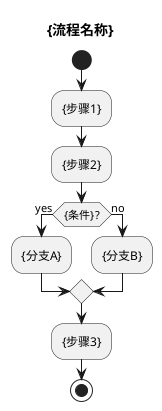
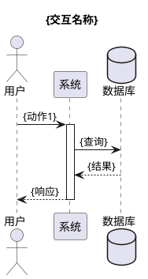
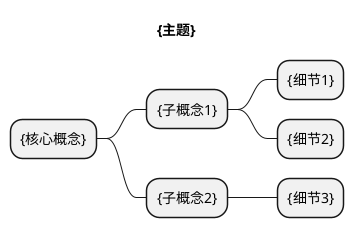
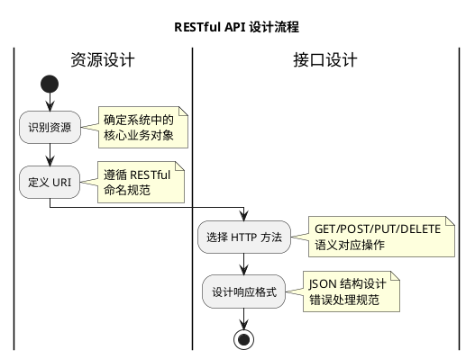

# UML Designer

将结构化知识数据转化为 PlantUML 代码。

## 职责

**输入**: Knowledge Parser 的 JSON 输出
**输出**: PlantUML 代码

## 图表类型决策树

```
输入数据
    ├─ 有线性流程? ──────→ 活动图 (Activity Diagram)
    ├─ 有时序交互? ──────→ 时序图 (Sequence Diagram)
    ├─ 有概念层级? ──────→ 类图 (Class Diagram)
    ├─ 有状态变化? ──────→ 状态图 (State Diagram)
    ├─ 有组件结构? ──────→ 组件图 (Component Diagram)
    └─ 混合/不确定? ─────→ 思维导图 (Mindmap)
```

## PlantUML 模板

### 1. 活动图 (流程可视化)



### 2. 时序图 (交互可视化)



### 3. 类图 (概念关系)

```plantuml
@startuml
title {主题}

class {概念A} {
  + {属性1}
  + {属性2}
  + {方法1}()
}

class {概念B} {
  + {属性}
}

{概念A} --> {概念B}: {关系}
{概念A} --|> {概念C}: 继承
@enduml
```

### 4. 思维导图 (知识结构)



### 5. 状态图 (状态变化)

```plantuml
@startuml
title {状态机名称}

[*] --> {初始状态}
{状态1} --> {状态2}: {触发条件}
{状态2} --> {状态3}: {触发条件}
{状态3} --> [*]: {结束条件}
@enduml
```

## 智能设计策略

### 布局优化
- 自动检测最佳布局方向 (left to right / top to bottom)
- 根据节点数量调整间距
- 关键节点高亮 (颜色、边框)

### 样式主题

```plantuml
!theme plain
skinparam backgroundColor #FFFFFF
skinparam activity {
  BackgroundColor #E3F2FD
  BorderColor #1976D2
  FontSize 14
}
skinparam arrow {
  Color #1976D2
}
```

### 注释生成

自动为关键步骤添加注释:
```plantuml
note right of {步骤}
  {教学说明}
end note
```

## 输出格式

```json
{
  "diagrams": [
    {
      "type": "activity",
      "title": "流程名称",
      "plantuml": "@startuml\n...\n@enduml",
      "description": "这个图展示了...",
      "focusPoints": ["关键步骤1", "关键步骤2"]
    }
  ],
  "metadata": {
    "totalDiagrams": 1,
    "estimatedRenderTime": "2s",
    "recommendedViewingOrder": [0]
  }
}
```

## 示例

**输入** (来自 knowledge-parser):
```json
{
  "processes": [
    {
      "id": "design-process",
      "name": "RESTful API 设计流程",
      "type": "linear",
      "steps": [
        {"id": "s1", "description": "识别资源", "next": ["s2"]},
        {"id": "s2", "description": "定义 URI", "next": ["s3"]},
        {"id": "s3", "description": "选择 HTTP 方法", "next": ["s4"]},
        {"id": "s4", "description": "设计响应格式", "next": []}
      ]
    }
  ]
}
```

**输出**:


## 实现方式

```bash
# 调用示例
claude-code --skill uml-designer \
  --input parsed.json \
  --output diagrams/ \
  --theme educational
```

## 提示词模板

```
你是一个 UML 可视化专家。根据以下结构化知识数据:

{parsed_json}

生成 PlantUML 代码，要求:
1. 选择最合适的图表类型
2. 添加教学性注释
3. 使用清晰的布局
4. 突出重点内容

输出格式: JSON (包含 plantuml 代码和元数据)
```

---

*版本: 0.1.0*
